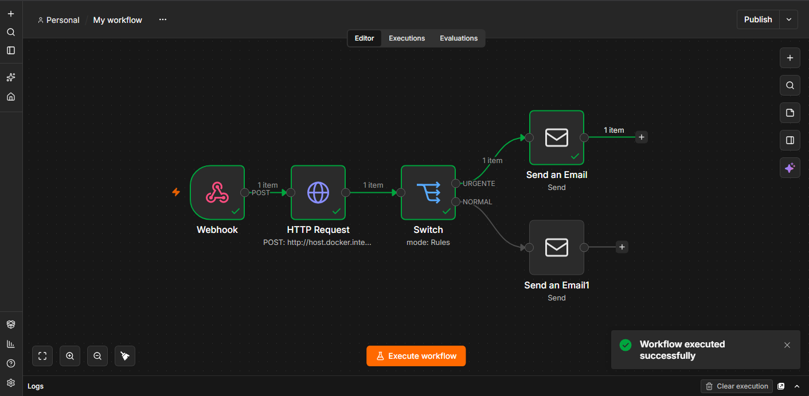

# AI Triage Router (PoC)

Sistema automatizado de triaje y notificación para gestión de propiedades y rentas vacacionales. Este proyecto intercepta webhooks, utiliza un **Modelo de Lenguaje Local (LLM)** para clasificar la urgencia de forma estricta y enruta correos electrónicos dinámicos en formato HTML.

---

## Arquitectura y Tecnologías

* **Orquestación:** n8n (Self-hosted)
* **Inteligencia Artificial:** LLM local ejecutado a través de inferencia privada (con optimización en GPU)
* **Notificaciones:** Motor SMTP de Gmail mediante Contraseñas de Aplicación.
* **Formatos:** Plantillas HTML estructuradas y deterministas.

---

## Arquitectura del Flujo

Aquí puedes ver cómo está estructurado el flujo visualmente en n8n:



---

## Cómo Probar el Sistema

Para simular la llegada de un reporte, dispara una petición POST hacia tu instancia local.

* **Método:** `POST`
* **URL:** `http://localhost:5678/webhook-test/ticket-urgency`
* **Headers:** `Content-Type: application/json`

### Payload de Ejemplo

```json
{
  "ticket_id": "TKT-0001",
  "propiedad": "Loft Acueducto",
  "huesped": "Juan P.",
  "mensaje": "La tubería de la cocina se reventó y el agua está llegando a la sala."
}
```
